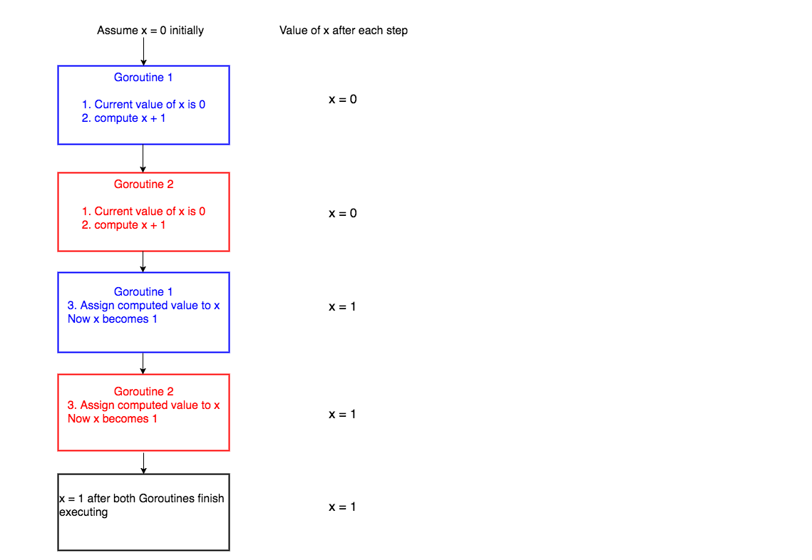
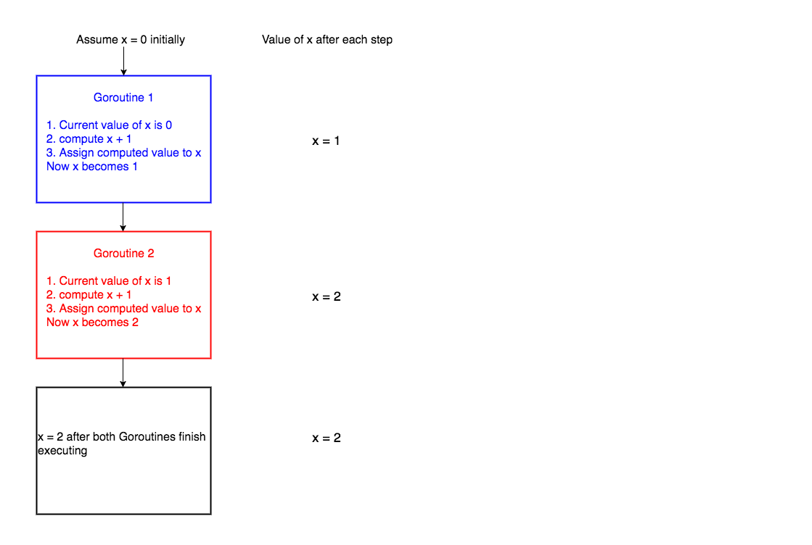

Critical section

Before jumping to mutex, it is important to understand the concept of critical section in concurrent programming. When a program runs concurrently, the parts of code which modify shared resources should not be accessed by multiple Goroutines at the same time. This section of code that modifies shared resources is called critical section. For example, let’s assume that we have some piece of code that increments a variable x by 1.

x = x + 1
As long as the above piece of code is accessed by a single Goroutine, there shouldn’t be any problem.

Let’s see why this code will fail when there are multiple Goroutines running concurrently. For the sake of simplicity let’s assume that we have 2 Goroutines running the above line of code concurrently.

Internally the above line of code will be executed by the system in the following steps(there are more technical details involving registers, how addition works, and so on but for the sake of this tutorial lets assume that these are the three steps),

get the current value of x
compute x + 1
assign the computed value in step 2 to x
When these three steps are carried out by only one Goroutine, all is well.

Let’s discuss what happens when 2 Goroutines run this code concurrently. The picture below depicts one scenario of what could happen when two Goroutines access the line of code x = x + 1 concurrently.

We have assumed the initial value of x to be 0. Goroutine 1 gets the initial value of x, computes x + 1 and before it could assign the computed value to x, the system context switches to Goroutine 2. Now Goroutine 2 gets the initial value of x which is still 0, computes x + 1. After this, the system context switches again to Goroutine 1. Now Goroutine 1 assigns its computed value 1 to x and hence x becomes 1. Then Goroutine 2 starts execution again and then assigns its computed value, which is again 1 to x and hence x is 1 after both Goroutines execute.

Now let’s see a different scenario of what could happen.

In the above scenario, Goroutine 1 starts execution and finishes all its three steps and hence the value of x becomes 1. Then Goroutine 2 starts execution. Now the value of x is 1 and when Goroutine 2 finishes execution, the value of x is 2.

So from the two cases, you can see that the final value of x is 1 or 2 depending on how context switching happens. This type of undesirable situation where the output of the program depends on the sequence of execution of Goroutines is called race condition.

In the above scenario, the race condition could have been avoided if only one Goroutine was allowed to access the critical section of the code at any point in time. This is made possible by using Mutex.